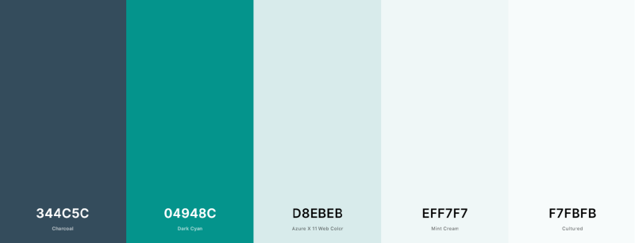

<h1 align="center">EU Kitespots</h1>

EU Kitespots is a website where users can look up kitesurf spots around Europe. Users can sign up and 
share their favourite kitesurf spots in Europe. The best kitesurf spots are often secret or difficult
to find on the internet. With this website kitesurfers, beginner to expert, can share their spots.

[View Live Website](https://eu-kite-spots.herokuapp.com/)

## Table of Content

- [User Experience](#user-experience-(ux))
- [Features](#features)
- [Technologies used](#technologies-used)
- [Testing](#testing)
- [Deployment](#deployment)
- [Credits](#credits)

## User Experience (UX)

### User stories

  - As a First time user I want to

    1. Find an explanation of the website and about what kitesurfing is.
    2. Be able to sign up and have my own profile.
    3. Be able to look up kitesurf spots by name, region.
    4. Be able to browse kitesurf spots by country.
    5. Access the website on mobile and desktop and for it to be responsive.
    6. Find more info about a kitespot when I click on it in the list of kitespots
    7. Find info about the country and their windseason.

- As a member I want to:

    1. Be able to add my own kitesurf spots.
    2. Log in with user friendly form.
    3. Edit and delete my own kitesurf spots.
    4. Get feedback for adding, editing, logging in and logging out.
    5. Get an error messages in case I have done something wrong or there is an issue with the database.

- As an admin I want to be able:

    to access, edit and delete ALL spots and countries from the admin profile

### Strategy
The goal of this website is so kitesurfers easily can find a website where they can find the latest popular kitesurf spots or share them.

### Scope
After looking around on the internet, you can find websites about kitesurfing in general and with popular spots around the world but nowhere
can you find a website where you can add your own and share it with other skitesurfers. This is what this website will specialize in. This way also experienced kitesurfers can share their
less touristic known spots to other kitesurfers around the world.

### Structure
Visitors are welcomed with an image to amaze them and see a kitesurfer in action. This give them the immediate idea what the website is about.
As they scroll down they will see an actual description of what the website is about and what kitesurfing is.
The log in and sign up page will have a similar clean look. There is 1 page where you can browse through all the kitesurf spots by name, region or country. When you click on a spot, you will be redirected to an individual page of that spot with all the info
There is also a page where you can look up spots by country.
When you click on one of the countries it will take you to a page with a brief description of the country and a all kitesurf spots in that country. 
When you sign up as a member you will be able to have a profile and a button in the navbar to add a kitesurf spot.
In the footer you will find the general navigation links. And on the left side you will find all the social media links.

### Surface

#### Colour Scheme
Shades of teal, dark blue shade, and white are chosen for the color scheme as it goes along with all the pictures of the kitesurf spots.

#### Typography
Montserrat is used as the general font-size of the website for it's clean typography and suitability with the logo. 
Cormorant Garamond is used for the dramatic headers to give it a touch of indie.

#### Imagery
Every image used on the website is a clear visualisation of what kitesurfing is, always chosen for the amazing looking backgrounds.
The home page has a gif with someone kitesurfing, so visitors can see the sport in action as a first interaction with the website.

### Skeleton

- Wireframe: 
    - Home page
    - log in and sign up page
    - Spots page
    - Countries page

## Features

Note:
Original plan was to implement a google maps API that will show all spots on a map on the spots template and
on the country pages displaying all the spots per country. But because of a lot of
unsuccesfull attempts trying to find solutions on how to implement google masp API and connect it to
the mongoDB Database, I decided to leave this out for this project.

### Existing Features
    - Log in
    - Register for an account
    - Search bar to look up spots by name and region with reset button. If nothing found will return 'No results'
    - Adding, editing and removing of spots in the profile only by registered users
    - Adding, editing and/or removing countries only by admin
    - Flash messages after every login, logout, add, edit and removal
    - Profile page displays username
    - Spot and countries have their own page
    - Input field validation in the forms
    - Responsive on all devices
    
### Future Features
    - Google maps API for all the spots to be displaying on
    - Password reset
    - More profile information to add and ability to edit them
    - SSL certificate
    - Registration with email or through Google
    - Page loading animation
    - Pagination on the spots page
    - Sort spots by region, experience and kitesurf season
    

## Information Architecture
MongoDB Atlas was used for storing data

## Technologies Used

### Languages Used

-   [HTML5](https://en.wikipedia.org/wiki/HTML5)
-   [CSS3](https://en.wikipedia.org/wiki/Cascading_Style_Sheets)
-   [Javascript](https://en.wikipedia.org/wiki/JavaScript)
-   [Python](https://www.python.org)

### Frameworks, Libraries & Programs Used:

1. [Materialize:](https://materializecss.com)
    was used to assist with the responsiveness and styling of the website.
    Used it for the nav bar, footer, card panels, cards, buttons, modal, text inputs and the icons in the log in and sign up forms.
2. [Google Fonts:](https://fonts.google.com/)
    was used to import the font-family 'Montserrat' and 'Cormorant Garamond' into the style.css file.
3. [Font Awesome:](https://fontawesome.com/)
    was used to add social media icons in the footer.
4. [Flask:](https://flask.palletsprojects.com/en/2.0.x/)
    Flask is the web framework used to provide libraries, tools and technologies for the app.
5. [Git:](https://git-scm.com/)
    was used for version control. In the terminal of Gitpod, I used Git to add and commit to Git and after pushing it to Github.
6. [GitHub:](https://github.com/)
    is used to store and share my project.
7. [MongoDB:](https://www.mongodb.com)
    used to set up the database and manage it.
8. [Balsamiq:](https://balsamiq.com/)
    was used to create the wireframes during the design process.
9. [TinyPNG:](https://tinypng.com/)
    was used to compress the images.
10. [Heroku:](https://www.heroku.com) 
    was used to deploy the website.
11. [Ezgif:](https://ezgif.com/)
    was used to convert a video to a gif.
12. [Savefrom:](https://en.savefrom.net )
    was used to download the youtube video used for the gif.
16. [JQuery:](https://jquery.com/)
    was used for the interactive elements from Materialize.
17. [Jinja:](https://jinja.palletsprojects.com/en/3.0.x/)
    Jinja was used for templating Python
18. [Werkzeug:](https://werkzeug.palletsprojects.com/en/2.0.x/)
    Werkzeug was used for password hashing in this project

## Testing

### Validators

The following validators were used to make sure there were no syntax errors in the project.

### Testing User Stories from User Experience (UX) Section

- #### As a First Time User I want to
    1. Find an explanation of the website and about what kitesurfing is.

    The explanation is showing on the home page.

    2. Be able to sign up and have my own profile.

    When you click in the nav bar on sign up you will get the following form

    3. Be able to look up kitesurf spots by name, region.

    In the search bar you can enter any name or region to find the kitesurf spot. You can also reset your search.

    4. Be able to browse kitesurf spots by country.

    When you click on countries in the navbar it will take you to a page with all the countries listed with pictures

    5. Access the website on mobile and desktop and for it to be responsive.

    Everything is made repsonsive and accessible on mobile devices as well

    6. Find more info about a kitespot when I click on it in the list of kitespots

    When you click on the name in the card, it will take you to an individual page about the spot. If clicked on the picture
    it will show you the description of the spot.

    7. Find info about the country and their windseason.

    When you click on one of the countries it will take you to the individual page of the country with a description, wind season table and the spots in the country.

- #### As a member I want to
    1. Be able to add my own kitesurf spots.

    To make it very accessible and easy to add a spot there are 2 ways. One link the navbar and a link in your profile.

    2. Log in with user friendly form.

    When you click on log in in the navbar it will take you to the log in page.

    3. Edit and delete my own kitesurf spots.

    In your profile you will be able to see all of your spots listed and with edit and delete options next to every spot.

    4. Get feedback for adding, editing, logging in and logging out.

    Everytime you add, edit, delete, log in or log out, there will be a flash message.

    5. Get an error messages in case I have done something wrong or there is an issue with the database.

    In case with an error the following error page will display with a link to go back to the home page.

- #### As an admin I want to be able:

    1. To access, edit and delete ALL spots and countries from the admin profile

    The admin's profile page will also have all the countries listed that the admin can edit and delete in the same
    way as with the spots.

### Manual Testing

### Further Testing

-   The Website was tested on Google Chrome, Microsoft Edge and Safari browsers.
-   The website was tested on all device sizes that are viewable in DevTools.
-   Family members and friends were asked to test the website on their devices.
-   The website was viewed on a variety of devices:

    Desktop:
    - HP Spectre Notebook
    - Sony VAIO Fit15E (laptop)
    - Acer Predator G5900 (computer)
    - ASUS 18363 (computer) 
    - ASUS N73S (laptop)

    Mobile:
    - Samsung Galaxy A41
    - Samsung Galaxy S7 2017
    - Samsung Galaxy A70
    - Huawei Y60 2018
    - Huawei P30 Pro
    - Xiaomi mi 9 SE

### Known Bugs

## Deployment

## Credits

### Code

- The python code in app.py was inspired by the task manager app mini project from Code Institute 
- Materialize: styling, responsiveness, nav bar, footer, card panels, cards, buttons, modal, text inputs and the icons in the log in and sign up forms.
- [Fade in effect home page](https://stackoverflow.com/questions/11679567/using-css-for-a-fade-in-effect-on-page-load)
- [Search bar](https://codepen.io/huange/pen/rbqsD)

### Video

The gif on home.html came from the following video: 
- [Drone footage - kitesurfing, Playa De Sotavento, Fuerteventura](https://youtu.be/c0LgNLFbon8)
Found on Youtube.com searching with a Creative common filter

### Images

Log in and sign up template:
- [Log in and sign up side picture](https://pixabay.com/photos/kite-surfing-kitesurfing-sea-3857693/)

Countries.html:
- [Greece](https://globalkitespots.com/wp-content/uploads/Greece-wind.png)
- [Italy](https://images.pexels.com/photos/417239/pexels-photo-417239.jpeg?auto=compress&cs=tinysrgb&dpr=1&w=500)
- [Portugal](https://cdn.pixabay.com/photo/2017/09/08/00/25/sea-2727251__340.jpg)
- [Spain](https://cdn.pixabay.com/photo/2014/08/19/13/01/sand-castle-421483__340.jpg)
- [Wind diagrams](https://globalkitespots.com/)

Spots:
- [Royal Sands Marmari Surf Club](https://photos.tpn.to/rs/os/oh/qi/653x490.jpg)
- [Playa De Sotavento](https://www.kiteworldmag.com/wp-content/uploads/2015/01/reneegli_zones-pic-by-kerstin-reiger.jpg)
- [La Cinta Sardinia](https://media.istockphoto.com/photos/spiaggia-la-cinta-kite-and-surf-beach-sardinia-italy-picture-id1064631184?k=6&m=1064631184&s=170667a&w=0&h=tpZGgR_Ok7mJSMRw4BN9nlvi4LCPsgAm2qLaT0iro4k=)
- [Bolonia](https://t4.ftcdn.net/jpg/00/05/41/15/360_F_5411543_IKg1nDJJjvvbRvUXaSrgyTTeKYO41Ou9.jpg)
- [Mikri Vigla](https://img.theculturetrip.com/768x/smart/wp-content/uploads/2020/08/kitesurfing-in-mikri-vigla-beach-on-naxos-island-greece.jpg)
- [Cabadelo](https://blog.bstoked.net/wp-content/uploads/2018/04/kiteboarding-in-portugal.jpg)
- [Favicon](https://icon-library.com/icon/kitesurf-icon-3.html)

### Content

- [Kitesurf description](https://www.thekitesurfcentre.com/what-is-kitesurfing)
- [Description Marmari Surf Club](https://www.worldpackers.com/locations/royal-sands-marmari-surf-club#:~:text=Time%201%20day-,Royal%20Sands%20Marmari%20Surf%20Club,experience%20for%20all%20our%20team.)
- [Description Playa De Sotavento](https://www.kiteworldmag.com/travel/sotavento-fuerteventura/)
- [Description La Cinta Sardinia](http://www.sardinianbeaches.com/best-kitesurfing-beaches-of-sardinia/)
- [Description Bolonia](https://wakeupstoked.com/kitesurf-tarifa-spain/)
- [Description Mikri Vigla](https://theculturetrip.com/europe/greece/articles/where-to-go-windsurfing-and-kitesurfing-in-naxos/)
- [Description Cadabelo](https://blog.bstoked.net/locations/top-5-kitesurfing-spots-in-portugal-new-in-2018/)

